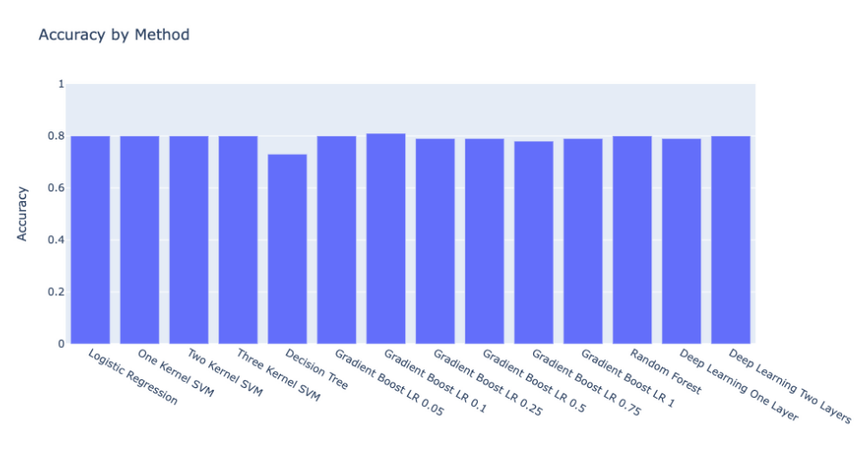
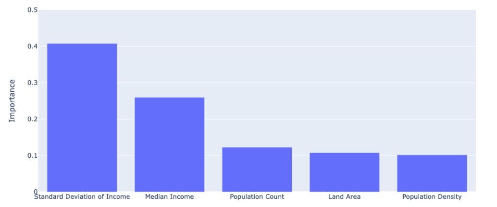

# Mental Health Predictor

## Selected Topic
- Predicting prevalence of poor mental health in United States based on various socioeconomic and enviornmental factors including, but not limited to:
  - populaton density
  - annual household income
  - water and land features
## Reason for Selecting Topic
- Building a model that can predict the prevalence of mental health risk for an individual based on specific features (factors)
- The prediction can provide awareness needed to address mental health concerns.
## Description of Data Sources
- 500 Cities: Local Data for Better Health, 2019. 500 Cities: Mental health not good for >=14 days among adults aged >=18 years ---[Centers for Disease Control and Prevention (CDC), Division of Population Health, Epidemiology and Surveillance Branch](https://chronicdata.cdc.gov/500-Cities-Places/500-Cities-Mental-health-not-good-for-14-days-amon/i2ek-k3pa)
  - Behavioral Risk Factor Surveillance System (BRFSS) data (2017, 2016)
    - Mental Health Severity: Respondents aged ≥18 years who report 14 or more days during the past 30 days during which their mental health was not good. 
- US Household Income Statistics---[Golden Oak Research Group LLC, “U.S. Income Database Kaggle”. Publication: 5, August 2017](https://www.kaggle.com/goldenoakresearch/us-household-income-stats-geo-locations/version/1)
- United States Cities Database---[SimpleMaps.com, Pareto Software LLC, compiled data from U.S. Geological Survey and U.S. Census Bureau](https://simplemaps.com/data/us-cities)
## Questions Hoping to Answer
- What are the most and least significant factors (features) in predicting prevalence of poor mental health in the US?
## Tools/Resources
- Creating ERD
  - [QuickDBD](https://github.com/nhafer88/Mental_Health_Predictor/blob/main/final_erd.png)
- Creating Database
   - SQLite
- Analyzing Data
  - Pandas
- Connecting to Database
- Machine Learning
  - Imbalanced-learn
  - Scikit-Learn
  - Tensorflow
  - Dashboard
  - Tableau
  - Javascript
  - Flask
  - HTML/CSS
## Machine Learning Model
- We used a binary outcome based on %poor mental health prevalence.
- The binary outcome was calculated by median split:
    - The median % poor mental health of the 500 cities was 13.89%. So…
      - If a city < 13.89% poor mental health → “Good Mental Health” 
      - If a city >= 13.89% poor mental health → “Bad Mental Health”
- Features were log-transformed and scaled to bring them into a normal distribution
- We tried logistic regression, support vector machines (1-3 kernels), decision tree, gradient tree boost (learning rates .05 - 1), random forest, and 1-2 layer deep learning
- We used 10-fold cross-validation - i.e., 10 machine learning instances of randomly allocating 90% of data to training and 10% to testing. We averaged the performance across the 10 instances.

## Presenation
- The presentation of the project will be found on a Google Slide Presenation,
[Here](https://docs.google.com/presentation/d/1T0pPPJlH2q55Iz5oIuN2MVgiFmE9DHhBDO7ZB3xee1I/edit?usp=sharing)
## Dashboard
https://nhafer88.github.io/Mental_Health_Predictor/
